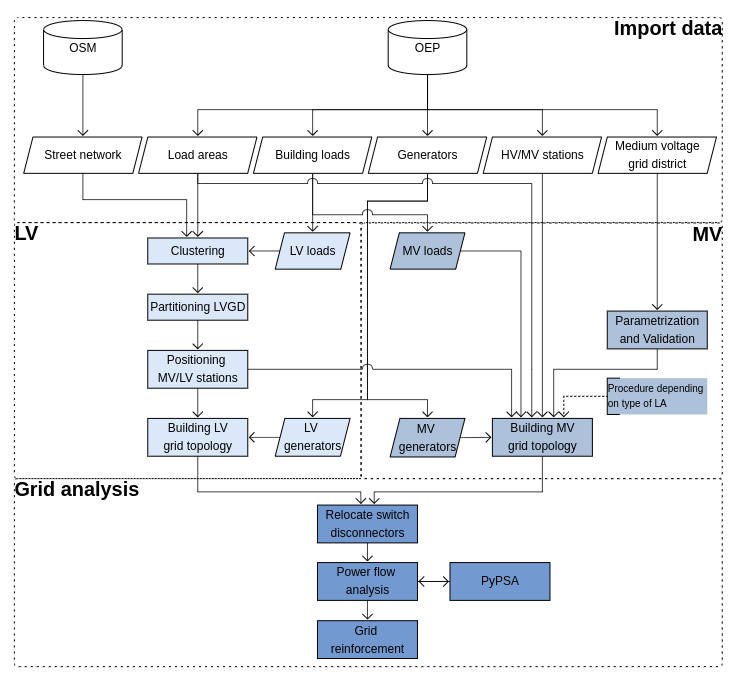

.. _theoretical_background:

######################
Theoretical background
######################
Ding0 is a tool designed for the generation of synthetic distribution
networks, serving as a valuable resource for simulating and analyzing electrical
distribution systems. This section provides an in-depth understanding of the
theoretical foundations and core processes that underlie the functionality of ding0.
The fundamental data basis is described in [Huelk2017]_ and its extension is
detailed by [Amme2017]_. Further refinements are contributed by [Dubielzig]_ and [John]_.
The flow chart below indicates the methodology of ding0 which is described more in detail below.

Data Import and Integration
===========================

The first step in the ding0 workflow involves the import of essential input data from two primary sources:

1. **Open Energy Platform (OEP)**
    OEP serves as a comprehensive data repository, supplying critical grid-related
    information. For each distribution network, the following data types are imported:

    ======================== =====
    Data Type                    Definition
    ======================== =====
    Load Areas                  Geographical clusters designed for electrical loads
    Building Loads              Electrical loads assigned to specific buildings
    MVGD                        Polygon defining the geographical area of the Medium Voltage Grid District (MVGD)
    HV/MV station               Location of the grid connection point between high -and medium voltage level
    Generators                  Renewable and conventional power generation sources located in the regarded MVGD
    ======================== =====

2. **Open Street Maps (OSM)**
    OSM provides the street network data, forming the geographical basis of the distribution network.

Data Processing
===============
1. **Allocation of Loads and Generators to belonging voltage level**

    **Loads**. High-resolution load data, which are allocated to specific buildings within the network area is categorized.
    This categorization involves associating them with a specific voltage level, thereby determining the type of
    grid connection they require. All loads **>1MVA** are considered for the MV ring topology (if connectivity is high).
    Others are connected via stub connection to the assigned grid level.

    ================== ================== =========================
    Voltage level       Nominal capacity    Allocation target
    ================== ================== =========================
    HV-MV (20kV)           5.5 - 20 MW         HV/MV substation
    HV-MV (10kV)           3 - 11 MW           HV/MV substation
    MV    (20kV)           0.2 - 5.5 MW        MV grid
    MV    (10kV)           0.2 - 3 MW          MV grid
    MV-LV (0.4kV)          0.1 - 0.2 MW        MV/LV substation
    LV    (0.4kV)          ≤ 0.1               LV grid
    ================== ================== =========================

    **Generators**. Depending on their nominal capacity, power generation sources are tagged with different allocation targets.
    Ding0 does not contemplate generators when building the initial grid topology. They are connected through stub
    connections to the grid topology afterwards as they play an important role for power flow analysis.

    ================== ================== =========================
    Voltage level       Nominal capacity    Allocation target
    ================== ================== =========================
    level 4 (HV-MV)     4.5 - 17.5 MW       HV/MV substation
    level 5 (MV)        0.3 - 4.5 MW        MV grid
    level 6 (MV-LV)     0.1 - 0.3 MW        MV/LV substation
    level 7 (LV)        ≤ 0.1               LV grid
    ================== ================== =========================

2. **Clustering, Partitioning and Positioning**

    #import cluster graph img... maybe one graph for each step

    **Clustering and Partitioning**. The clustering process divides the road graph into subnetworks while considering
    the inherent structure of the graph during cluster analysis. These resulting clusters, when
    combined with the associated buildings, collectively constitute the Low Voltage Grid Districts (LVGDs)
    within a Load Area (LA).

    **Positioning**. In each LVGD, the street point located at the load center of the LV grid is calculated,
    considering only LV loads. This load center is utilized to determine the positioning of the MV/LV substation.

    Details are presented in [Dubielzig]_.

3. **Parametrization and Validation**

    **Parametrization**. In the parameterization phase, technical specifications for the MVGD are determined, including voltage levels
    based on load density and distance between LA centers and the HV/MV substations. Load density exceeding 1 MVA/km² or distances
    below 15 km results in an operating voltage of Vₙ = 10 kV; otherwise, Vₙ = 20 kV. This defines the use of underground cables (10 kV)
    or overhead lines (20 kV) in the network. **Aggregated LAs** are identified when

    .. math::
        PLA ≥ \frac{Imax,th}{(3√{V_{n}})}

    classifying them as urban regions. PLA refers to the peak load of the regarded LA. Transformer types are chosen based on peak loads,
    with HS/MS transformers operating at up to 60% load and MS/NS transformers at up to 100% load, ensuring redundancy and (n-1) security
    for the substation.

Low Voltage (LV) Grid Construction
==================================

Clustering and partitioning
----------------------------

- The LV grid generation process begins with the clustering of LV Load Areas (LAs) based on the capacity of LV loads within each LA.
- Clustering results in the formation of clusters, and a clustered graph is positioned according to street topology.
- These clusters serve as the foundation for creating LV Grid Districts (LVGDs).

MV/LV substation Placement
--------------------------------

- LVGDs are defined, partitioning LAs into LVGDs, each of which is associated with a load center.
- MV/LV stations are strategically positioned at the load centers of LVGDs.

Building the LV Grid
--------------------

- The LV grid is then constructed within each LVGD, utilizing the OSM network.
- Loads with a demand of less than 100 kW are directly connected to the street graph.
- Loads with a demand between 100 kW and 200 kW are linked directly to the MV/LV station.
- Branching occurs from the MV/LV station based on capacity constraints, finalizing the LV grid topology.
- LV generators are integrated into the LV grid topology, with two possible connection levels:
    - Level 6: Connects generators to LV stations.
    - Level 7: Connects generators to the closest LV-grid node.

Medium Voltage (MV) Grid Construction
=====================================

###hier grafik einfügen

MV Grid in rural areas (regular & satellite LAs)
---------------------------------------

    **Assumptions** are established that underlie the entire MV grid generation process

    ========================================  ==================================================================================================
     Assumption                               Value
    ========================================  ==================================================================================================
     Type of topology                         Open ring topology
     Voltage Level (MV)                       20 kV (if load density > 1 MVA/km² or distance between LA centers < 15 km), 10 kV (otherwise)
     Preferred Cable Type (10 kV)             Earth Cables
     Preferred Cable Type (20 kV)             Overhead Lines
     Maximum Line Loading normal              Up to 60%
     Maximum Line Loading failure             Up to 100%
     Maximum Voltage Drop normal              5 %
     Maximum Voltage Drop failure             10 %
     Detour Factor                            1.3
     Reactive Power requirements loads        cos(φ)=0.9
     Reactive Power requirements generators   cos(φ)=1
    ========================================  ==================================================================================================

    **Rounting** The routing for the initial grid topology in the context of the ding0 tool is
    based on the Capacitated Vehicle Routing Problem (CVRP) formulation which is solved by a two-stage
    metaheuristic approach. The classic CVRP optimization problem is adapted for designing the MV grid,
    with the objective of determining the most efficient routes for supplying electricity to different
    MV gird connection points (MV/LV substations and MV loads).
    First, the initial routes are constructed using a parallel savings heuristic of
    Clarke and Wright. This heuristic identifies potential savings by combining routes and iteratively
    improves the solution. Only centers of LAs are regarded as potential points for the algorithm.
    Second, local search heuristics are used to refine the routes further.

    ========================================  =============================== ====================================================================
    CVRP notation                             Appliance to grid planning        Explanation
    ========================================  =============================== ====================================================================
    customers                                 Centers of LAs                    Location that needs to be visited
    depot                                     HV/MV substation                  Central point from which the MV grid routes originate and return
    ========================================  =============================== ====================================================================

    Throughout the routing process, various technical constraints are considered, including current carrying capacity,
    voltage stability, load factor, line loading, and operational modes (normal and faulty). These constraints ensure that the designed grid
    remains technically feasible and reliable.

    **Grid extension** The initial MV grid topology is extended by those MV grid connection points that are adversed above
    due to proximity reasons or technical constraints. Three sequential steps are executed to connect satellite LAs, MV/LV substations,
    and generation units to the existing grid are proceeded by applying the order of connection respectively.

        **(1)** Nodes within a proximity of ≤ 100 meters to an existing grid route are integrated into the grid by adjusting the route's path.

        **(2)** Geographic Information System (GIS) methods are used to find and connect remaining nodes, starting with a search radius of 2000 meters.
        The radius expands incrementally if no suitable points are found.

        **(3)** If the above connection options are infeasible due to technical constraints, nodes are directly connected to the main route using
        separate branch lines and the standard line type.

    Details on routing principles for MV grid topology are presented in [Amme2017]_. Be aware that there have been major changes in
    methodology since the publishing of this paper:

    ==================================================   ======================================================================================================
     Initial methodology                                    Update
    ==================================================   ======================================================================================================
     Sector-specific electricity demand                     High resolution load data for each building
     Equidistant grid of points for MV/LV substations       Location of MV/LV substations are based on load center of each LVGD
     Voronoi partition for LVGD definition                  Definition of LVGDs as a result of clustering by loads
     No MV loads                                            Heavy load electricity consumers are classified as MV loads and connected within that voltage level
    ==================================================   ======================================================================================================

MV Grid in urban areas (aggregated LAs)
---------------------------------------
Aggregated Local Areas (LAs) are characterized by a high cumulative power demand, classifying them as urban regions.
In these LAs, each is connected to the HV/MV substation through at least one direct connection, which depends on the cumulative load.
To design the MV grid within aggregated LAs, actual road network distances (OSM) are considered. The graph representing this network
is preprocessed and divided into two components: G_core, which contains potential MV-ring topology customers, and G_stub, which
includes the remaining customers for MV grid connection via stubs.

Initially, all well-connected customers (those with at least two neighbors) are primarily assigned to G_core.
Subsequently, the stub connection criteria are evaluated, considering a load threshold of <1 MVA. Customers exceeding
this threshold are also moved from G_stub to G_core to ensure grid stability. The final G_core graph encompasses all customers considered
for the initial MV ring topology. The routing procedure aligns with that used in rural areas, with the additional constraint of
network distances being considered instead of air distances. The Dijkstra Algorithm plays a crucial role in determining the precise
road geometries of ring circuits and their lengths.

    ========================================  =============================== ====================================================================
    Criterion                                   Rural area                      Urban area
    ========================================  =============================== ====================================================================
    Distance calculation                         Street network                    Air distances * detour factor
    Customers for initial ring topology          LA centers                        Final G_core components (MV/LV stations + MV loads)
    Customers for stub connection                missing LA centers,               Final G_stub components (MV/LV stations + MV loads)
                                                 generators, MV/LV stations
    Voltage level                                10kV and 20kV                     mostly 10kV
    Connection type                              Cables and overhead lines         mostly cables (underground)
    ========================================  =============================== ====================================================================

Details on MV grid design in urban areas are presented in [Dubielzig]_.

Grid Analysis and Reinforcement
===============================

Relocating Switch Disconnectors and Power Flow Analysis
-------------------------------------------------------

- In preparation for power flow analysis, switch disconnectors in the MV grid are strategically relocated to minimize power flow. This ensures that MV rings operate as isolated half rings.
- The power flow analysis results are exported to the PyPSA format for further analysis.

Grid Reinforcement
------------------

- Grid reinforcement measures are employed to enhance network robustness. This includes:
    - Reinforcing branch current by altering cable types to meet overload criteria.
    - Strengthening node voltages by identifying critical nodes and reinforcing the associated branches.
- Once grid reinforcement is complete, switch disconnectors are closed, finalizing the network configuration.

Understanding these foundational aspects of ding0 is essential for effectively utilizing the tool's capabilities in research, testing, and analysis within the realm of electrical engineering and distribution system modeling.

Data basis
==========

The fundamental data basis is decribed in [Huelk2017]_ and its extension is
detailed by [Amme2017]_. Further extensions and additional details are provided
in the sections below.

:ref:`definition-of-terms` introduces terms we stick to in the following text.

.. _definition-of-terms:
.. figure:: images/mvgd_la_lvgd-mit_ortsnamen.png

    Definition of names

.. _lv-trafo-and-grid-district:

MV/LV Substations and LV grid district
--------------------------------------

Medium-voltage/low-voltage (MV/LV) substations are located on a equidistant
grid of points with an interval of 180m within the load areas.
Cable length in low-voltage (LV) grids ranges from 100-1.500m (see [Kerber]_,
[Scheffler]_, [Mohrmann]_).
According to [Scheffler]_, a cable length of 200 m to 300 m is most typical.
Furthermore, we foud a difference between the cable length and the line over
ground is 72% (1.39 Umwegfaktor), see master thesis Jonas Gütter.
This seems plausible compared to the value for the MV grid of 77% (1.3).
The chosen value concludes in cable lengths of 250m at the shortest distance and 283m at the longest distance between the middle point of the square and its outer line.

* Finding LV-Grid districts (LV-GD):
  We define Voronoi polygons within the load areas based on a grid of points with an interval of 180m.
* Assign consumption to the LV-GD:
  This works analogously to the methods for the MV-GD, as described in "Allocation of annual electricity consumption and power  generation capacities across multi voltage levels in a high spatial resolution" (Huelk)
* Assign peak load

Medium-voltage grids
====================

Methodological details and exemplary results are presented in [Amme2017]_.

Low-voltage grids
=================

The topology of low-voltage grids is determined on the basis of typified grid
models that are vastly available for the residential sector and partially
available for other sector retail, industrial and agricultural.
The mentioned sectors are modeled differently: the grid topology of residential
sector loads founds on typified grid models from [Kerber]_. Retail and
industrial sector are treated as a single sector and use same methodology to
determine grid topology as applied for the agricultural sector.
Loads of each sector are located in separate branches - one for each sector.
In the following its creation is described in detail.

.. Kerber describes 8 rural and 3 village and 8 suburban LV Grids; each with several branch lines. The exemplary grids are based on 132 real MV/LV Substations data in south Germany.
.. Scheffler gives statistical data about technical parameters of LV grids divided on 8 types of settlement areas.
.. Mohrmann discribes statistical data about technical parameters of LV grids based on 2700 LV-Grids.
.. Demirel
.. VNS

However, a method to generate a representative variation of LV-grids, that can be assigned to the modeled LV/MV substations cannot be found.
Given data on MV/LV substations: 

* land use data divided in industry, commercial, agriculture and residential
* population
* peak load
* Define transformer

Branches of sector residential
------------------------------

.. TODO: Editha

#. LV-Branches

    We are using the LV-Branches of Kerber from the grids. They should be assigned to the most plausible types of settlement areas.

#. Define the type of settlement area

    To decide if a LV-grid district is most likely a rural, village or suburban settlement area we are using the population value combined with statistical data. Statisticly, there are 2.3 persons per appartment and 1.5 appartments per house. [see BBR Tabelle B12 http://www.ggr-planung.de/fileadmin/pdf-projekte/SiedEntw_und_InfrastrFolgekosten_Teil_2.pdf] [DEMIREL page 37-41, average has been coosen]. (This is not valid for urban areas.) With this we estimate the amount aus house connections (HC).

    This value can also be found at the explenation of the database of the "Kerber"-grids and is assinged to the type of settlement area:

    * Rural: 622 HC at 43 MV/LV substations results in an average amount of 14.5 HC/substation
    * Village: 2807 HC at 51 MV/LV substations results in an average amount of 55 HC/substation
    * Suburban: 4856 HC at 38 MV/LV substations results in an average amount of 128 HC/substationTher

    With the resulting trendline of this three point,  [the Polynomial degree 2 [ 16.127*(x^2)-7.847*x+6.1848 ] whereas x is the type of of settlement area], we difine the border values for the typ of settlement area at:

    * Rural <31 HC/substation
    * Village <87 HC/substation
    * Suburban >=87 HC/substation

#. Assinging grid branches to the Substations

    within the "Kerber"-model-grids several grid branches are found.
  
    * Rural: 5 branches (with l>=78m & l<=676m)
    * Village: 7 branches (with l>=102m & l<=588m)
    * Suburban: 15 branches (with l>=85 & l<=610m)
  
  
Strangzuweisung
Zu jeder ONS werden in Abhängigkeit von Netztyp und HA, NS-Stränge zugewiesen
Eine Verteilung des Aufkommens der Stränge anhand von der Gesamtstranglänge geschieht mit Hilfe der Scheffler Angaben (Abbildung      Länge der Netzstrahlen für ausgewählte Siedlungstypen [44])

   #. Categorising grid branches form "Kerber" model grids

Hinzu kommen auf Basis von kerber interpolierte stränge um Lücken in der Vollständigkeit zu schließen

Branches of sector retail/industrial and agricultural
-----------------------------------------------------

Creating individual LV grid branches for the sectors retail/industrial and
agricultural applies the same methodology.
The topology of these grid branches determines by the sectoral peak load that
is available at
high spatial resolution (see [Huelk2017]_). Furthermore the number of land-use
areas (taken from [OSM]_) of each of the sectors determines the number
individual loads connected to one or more of these sectoral branches.

The topology of each sectoral branch is affected largely by assumptions on
parameters that are provided in the table below.

.. _assumptions:

========================================================= =====
Parameter                                                 Value
========================================================= =====
Max. load in each branch                                  290 kVA
Max. branch length retail/industrial :math:`L_{R/I,max}`  400 m
Max. branch length agricultural :math:`L_{A,max}`         800 m
Length of branch stub                                     30 m
PV peak power <= 30 kW                                    residential
PV peak power > 30 kW <= 100 kW                           retail/industrial or agricultural
PV peak power > 100 kW                                    MV/LV station bus bar
========================================================= =====

In each LV grid district (LVGD) (see :ref:`lv-trafo-and-grid-district`) sectoral
peak load of sectors retail+industrial and agricultural are analyzed. The
number loads of each sectors determines by dividing sectoral peak load by
number of land-use area found in this grid district.

.. math::
   N_{loads} = P_{sector} \cdot N_{land-use}

In the next step individual loads are allocated to branches considering the
limit of max. 290 kVA peak load connected to a single branch. If a single load
exceeds the limit of 290 kVA, it is halved until it is smaller than or equal
to 290 kVA.
Loads are distributed equidistant on the branches while the branch does not
necessarily take the maximum length defined in the table above.
The distance defines as

.. math::
   d_{sector} = \frac{L_{sector,max}}{N_{loads} + 1}

Single loads are connected to the branch line by stubs of a length of 30 m.

Photovoltaic (PV) power plants are allocated to different sectoral LV grid branches
depending on the nominal power. The allocation by the nominal power is provided
in the above table. It follows a simple assumption: smaller PV power plants are
allocated to LV grid branches of sector residential, larger power plants
are allocated to branches of the other sector, and really large ones are
directly connected to the bus bar of the MV-LV substation.

Grid stability and equipment
~~~~~~~~~~~~~~~~~~~~~~~~~~~~

During build of LV grid topology equipment is chosen with respect to max.
occurring load and generation according to current grid codes (see [VDEAR]_).
Nevertheless, some overloading issues may remain. In addition, voltage issues
may arise that can't be considered during grid topology creation. Therefore, we
adhere to the regulatory framework of [DINEN50160]_ which is simplified by
[VDEAR]_.
According to [DINEN50160]_ voltage deviation is limited to +/-10 % of nominal
that is for practical use divided into voltage drop/increase for each voltage
level and the associated transformers. The allowed voltage increase in the LV
grid level is limited to 3 % of nominal voltage. The allowed voltage drop is
limited to 5 % as detailed in [Zdrallek]_.

.. as detail by :numref:`Image of Sphinx (Fig. %s) <voltage-deviation>`.

.. .. _voltage-deviation:
.. .. figure:: images/DIN_EN_50160_voltage_drop_scheme.png
..
..    Allowed voltage bandwidth in distrivution grids detailed for each grid
..    level. Source [Zdrallek]_

Following steps do apply during reinforcement of Ding0 LV grids

#. Checks for **overloading** issues at branches and MV-LV transformers first
#. Critical branches (those with line overloading) are extended to appropriate
   size of cable to transport connected load and generation. Note, if connected load or
   generation capacity is still exceeding capacity of largest cable type. We keep
   largest available cable type and the issue most probably will remain
#. Stations are tested for overloading issues for generation and load case as
   well. If nominal apparent power of transformers of a substation is not
   sufficient a two-step procedure is applied

   #. Existing transformers are extended (replaced) to comply with load and
      generation conencted to subsequent grid.
   #. If Step 1 does not resolve all issues additional transformers are build
      in the substation
#. Subsequently **over-voltage issues** are analyzed for all grid nodes
#. For each node where voltage exceeds 3 % of nominal voltage in feed-in case or
   5 % of nominal voltage in load case, branch segments
   connecting the node with the substation are reinforce until no further issues
   remain. If a over-voltage issue cannot be solved by installing largest
   availabe cable (NAYY 4x1x300) this type of cable still remains as well as
   the overvoltage issue
#. Substations are checked for over-voltage issues at the bus bar individually.
   Identified issues are resolved by extending nominal apparent power of
   existing transformer. A ultimately build up to two new transformers in the
   substation.

References
----------
.. [Amme2017] J. Amme, G. Pleßmann, J. Bühler, L. Hülk, E. Kötter, P. Schwaegerl:
    *The eGo grid model: An open-source and open-data based synthetic medium-voltage
    grid model for distribution power supply systems*. Journal of Physics Conference
    Series 977(1):012007, 2018, `doi:10.1088/1742-6596/977/1/012007 
    <http://iopscience.iop.org/article/10.1088/1742-6596/977/1/012007>`_
.. [Huelk2017] L. Hülk, L. Wienholt, I. Cussmann, U. Mueller, C. Matke and E.
    Kötter: *Allocation of annual electricity consumption and power
    generation capacities across multi voltage levels in a high spatial
    resolution*. International Journal of Sustainable Energy Planning and Management
    Vol. 13 2017 79–92, `doi:10.5278/ijsepm.2017.13.6 <https://doi.org/10.5278/ijsepm.2017.13.6>`_
.. [Dubielzig] P. Dubielzig: Modellierung synthetischer Verteilnetztopologien
    in urbanen Gebieten, Dissertation, TU Berlin, 2022
.. [John] R. John: Planning of Synthetic Low Voltage Networks
    with Geographical Constraints, Dissertation, Offenburg University, 2021
.. [Kerber] G. Kerber: Aufnahmefähigkeit von Niederspannungsverteilnetzen für
    die Einspeisung aus Photovoltaikkleinanlagen, Dissertation, TU München,
    2011
.. [Scheffler] J. Scheffler: Bestimmung der maximal zulässigen
    Netzanschlussleistung photovoltaischer Energiewandlungsanlagen in
    Wohnsiedlungsgebieten, Dissertation, TU Chemnitz, 2002
.. [Mohrmann] M. Mohrmann, C. Reese, L. Hofmann, J. Schmiesing: Untersuchung
    von Niederspannungsverteilnetzen anhand synthetische Netzstrukturen. In:
    Proceedings of VDE ETG Kongress, 2013
.. [OSM] OpenStreetMap contributors:
    `Open street map <https://www.openstreetmap.org>`_, 2017
.. [VDEAR] VDE Anwenderrichtlinie: Erzeugungsanlagen am Niederspannungsnetz –
        Technische Mindestanforderungen für Anschluss und Parallelbetrieb von
        Erzeugungsanlagen am Niederspannungsnetz, 2011
.. [DINEN50160] DIN EN 50160 Merkmale der Spannung in öffentlichen
    Elektrizitätsversorgungsnetzen, 2011
.. [Zdrallek] Planungs und Betriebsgrundsätze für ländliche Verteilungsnetze --
    Leitfaden zur Ausrichtung der Netze an ihren zukünftigen Anforderungen, 2016
