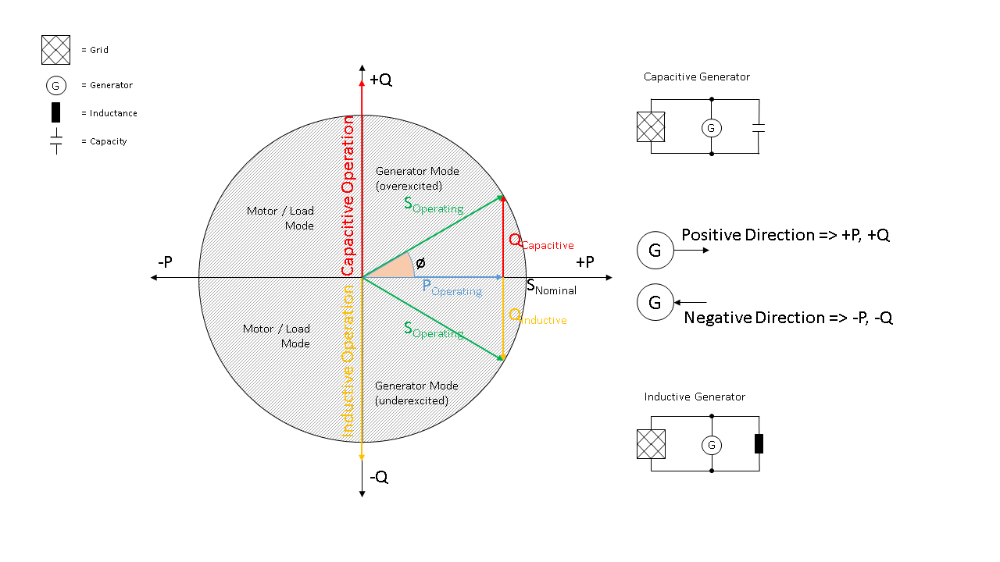

Calculation principles
~~~~~~~~~~~~~~~~~~~~~~

Reactance
#########

We assume all cables and overhead lines to be short lines. Thus, the capacity
is not considered in calculation of reactance of overhead lines and cables.

.. math::
    x = \omega * L

Apparent power
##############

* Given maximum thermal current `I_th_amx` (`I_L`) is given per conducter (of three
  cables in a system)/per phase.

* We assume to have delta connection. Thus, nominal voltage per conducted can be
  applied to calculate apparent power `s_nom` and conductor current `I_L` has to
  be transformed to `I_delta` respectively to `I` by

  .. math::
      I = I_{delta} = \sqrt{3} \cdot I_L

* Apparent `S` power is calculated to

  .. math::
      S = U \cdot I = U \cdot I_{th,max}

Sign Convention
###############

Generators and Loads in an AC power system can behave either like an inductor
or a capacitor. Mathematically, this has two different sign conventions,
either from the generator perspective or from the load perspective.
This is defined by the direction of power flow from the component.

Both sign conventions are used in Ding0 depending upon the components
being defined, similar to pypsa.

Generator Sign Convention
-------------------------
.. _generator_sign_convention_label:

    Generator sign convention in detail

Load Sign Convention
^^^^^^^^^^^^^^^^^^^^
.. _load_sign_convention_label:

    Load sign convention in detail

Ding0 makes the sign convention easier by allowing the user to provide
the string values "inductive" or "capacitive" to describe the behaviour
of the different assets better. The sign convention for different parts of
ding0 are handled internally.