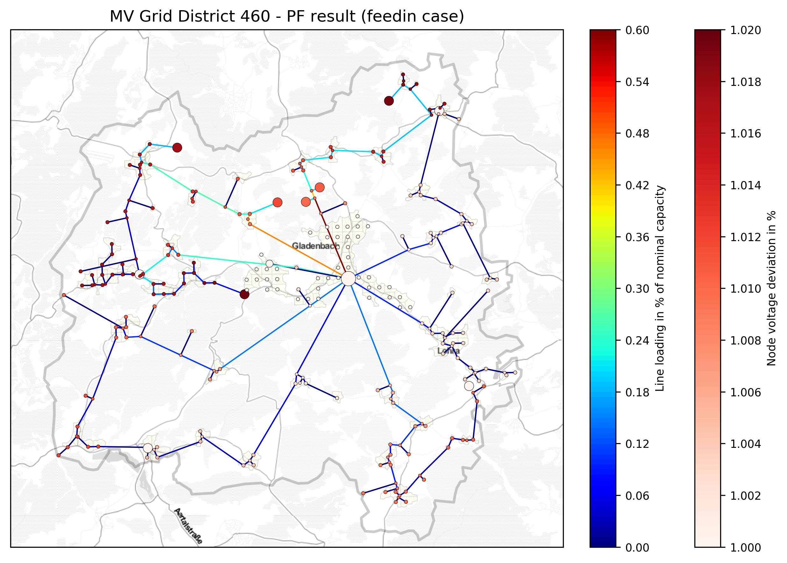

.. _ding0-examples:

How to use ding0?
~~~~~~~~~~~~~~~~~

Examples
========

We provide two examples of how to use Ding0 along with two example for analysis
of resulting data. The
:download:`first example <../ding0/examples/example_single_grid_district.py>` shows how Ding0
is applied to a single medium-voltage grid district. Grid topology for the
medium- and low-voltage grid level is generated and saved to a file (.pkl).
The :download:`analysis script <../ding0/examples/example_analyze_single_grid_district.py>`
takes data generated in the first example and produces exemplary key
figures and plots.

The :download:`second example <../ding0/examples/example_multiple_grid_districts.py>` shows 
how to generate a larger number of grid topology data
sets.
As the current data source sometimes produces unuseful data or leads to program
execution interruptions, grids that cannot be created are excluded from grid topology 
generation. This
is enable by setting :code:`failsafe=` to `True`.
The according :download:`analysis script <../ding0/examples/example_analyze_multiple_grid_districts.py>` 
provides exemplary plots for data of multiple grid
districts.

High-level functions
====================

Run ding0
---------

Check out :meth:`~core.Network.run_ding0()` as high-level function which is also used in the
:download:`example <../ding0/examples/example_single_grid_district.py>`.

For larger calculation (parallelization)
----------------------------------------

To generate data for a larger area consider to parallelize execution of Ding0
as done in the :download:`parallelization example <../ding0/examples/example_parallel_multiple_grid_districts.py>`.

Analysis of grid data
=====================

Plot results
------------

The :func:`~.tools.plots.plot_mv_topology` allows plots of the MV grid including grid topology
with line loadings and node voltages. You can simply fire it using an MVGrid instance or pass argument
:code:`export_figures=True` to :meth:`~core.Network.run_ding0()` to export some key plots.
The plotting allows to draw a background map. For this function, the package `contextily` is needed which
is not included in the standard ding0 installation. If you want to use this feature, you can simply install it by

.. code-block:: python

    pip3 install contextily

See plotting function for a detailed description of possible modes and parameters.

Example plot:

Export key figures
------------------

We provide a set of functions to export key figures of the generated data.
The following assumes a Ding0 network is generated as follows:

.. code-block:: python

    from egoio.tools import db
    from ding0.core import NetworkDing0

    engine = db.connection(section='oedb')
    session = sessionmaker(bind=engine)()

    network = NetworkDing0(name='network')
    network.run_ding0(
        session=session,
        mv_grid_districts_no=[3040])

Extract key information about medium and low voltage grid topology.

.. code-block:: python

    from ding0.tools.results import calculate_mvgd_stats

    # statistical key figures of medium voltage grid
    mv_stats = calculate_mvgd_stats(network)

    # statistical key figures of medium voltage grid
    lv_stats = calculate_lvgd_stats(network)

Information about power flows and voltage levels from final approving power flow
analysis can be obtained from
:func:`~.tools.results.calculate_mvgd_voltage_current_stats` and
:func:`~.tools.results.calculate_lvgd_voltage_current_stats`.

If a large number of grid districts is involved consider to parallelize the
execution by

.. code-block:: python

    mv_stats,
     lvgd_stat
     mv_nodes,
     mv_edges,
     lv_nodes,
     lv_edges = parallel_running_stats(
        districts_list = mv_grid_districts,
        n_of_processes = n_of_processes,
        n_of_districts = n_of_districts,
        source = 'pkl',
        mode = '')

Data is read from file and returned in six tables.

Furthermore, the function :func:`~.core.Network.to_dataframe()` allows to get
tabular information about nodes and edges of the grid topology representing
graph.

.. code-block:: python

    nodes, edges = network.to_dataframe()

Compare data versions
---------------------

Data generated by different versions of Ding0 or different input data can be
easily compared. Load datasets designated for comparison and pass to
:func:`~.tools.results.dataframe_equal`.

.. code-block:: python

    network_a = load_nd_from_pickle(filename='filename_a.pkl')
    network_b = load_nd_from_pickle(filename='filename_b.pkl')

    passed, msg = dataframe_equal(network_a, network_b)

Explanation of key figures
--------------------------

========= ======================================= ====
Parameter Description                             Unit
========= ======================================= ====
km_cable  Cumulative length of underground cables km
========= ======================================= ====

Ding0 IO : Ding0 exporter
=========================
Introduction
--------------
The ding0 exporter provides the ding0 network topology data in a structured format. The main component is the
export.py which transforms the ding0 network to several pandas dataframes. The main purpose is to provide
the Data as table based format using a broadly known technology. The following will explain
the main usage of the exporter.py and introduce its inputs and possible outputs.

The exporter contains the function export_network(). This function takes three parameters: a network
object, the mode which is currently not implemented, and the run_id.

Note:
The run_id should be set if the network is not created but imported from pickle files.

What is the input?
------------------
Ding0Network can be run for a single or multiple GridDistricts. As mentioned a Ding0Network must be created
from a versioned Ding0 "run" that has been stored in pickle files before. The other options is to initialize
a new version by running ding0 again. The difference will be most obviously be noticed by looking at the run_id.
So the input would the ding0 network and the coherent run_id.

What is the output?
-------------------
The function export_network() returns a list of nametuples. The nametuple contains 17 elements. The main
purpose of that is to return Pandas dataframes that store the Ding0Network data. But 2 elements also provide
further information like the actual run_id that was set or newly created and a metadata_json that stores
the assumptions ding0 uses to create the network topology.
Since Pandas is a Python package that is used very frequently the IO functionality of pandas can be used
for several tasks. See pandas IO.

What IO functionality is implemented?
-------------------------------------
Currently the Ding0Network can be serialized as pickle files in python. It can also be stored in
Tables on a relational database as well as saved to CSV files.

IO settings
-----------
The io settings are provided within a config file that is located in the ding0/config folder. The file is
named exporter_config.cfg. In the current state it just stores the database schema that is used as destination
for any exports to a database. The config file is imported as config-object using the package "ConfigObj".
In the future all static options should be stored in this file.

Export ding0 to database
=========================
Ding0 Table
-----------
In order to export the provided, ding0 related, Pandas dataframes to a database one must create specific tables
first. The table definition and metadata(using string version 1.3: see Ding0 table metadata) is provided within
the module "ding0_db_tables.py".

The table definition is implemented using SQLAlchemy.

The following gives a short description for all tables. Note that all tables own the run_id form the versioning
table as foreignKey. All tables depend on the existing run_id.

Table specification
-------------------
OpenEnergyDatabase schema name: grid

The database schema is selected based on the topic for which the data provides information.

Note: The following tables can be generated automatically from a metadata string.
To create the tables this script_ is provided.

.. _script: https://gist.github.com/gplssm/63f11276387875763f2bbc7f9a5fdb8f

versioning
----------
===========  =================================  ==============
name         description                        unit
===========  =================================  ==============
id           unambiguous unique numer           integer
run_id       time and date of table generation  yyyyMMddhhmmss
description  Used parameters for this run       string
===========  =================================  ==============

line
----
=========  ====================================================================================  ================
name       description                                                                           unit
=========  ====================================================================================  ================
id         unambiguous unique numer                                                              integer
run_id     time and date of table generation                                                     yyyyMMddhhmmss
id_db      unambiguous number of corresponding grid (MVgrid-id if MV-edge, LVgrid-id if LV-edge  integer
edge_name  unambiguous name of edge                                                              string
grid_name  unambiguous name of grid                                                              string
node1      id_db of first node                                                                   string
node2      id_db of second node                                                                  string
type_kind  n/a                                                                                   string
type_name  n/a                                                                                   string
length     length of line as float                                                               km
u_n        nominal voltage as float                                                              kV
c          inductive resistance at 50Hz as float                                                 uF/km
l          stored as float                                                                       mH/km
r          stored as float                                                                       Ohm/km
i_max_th   stored as float                                                                       A
geom       geometric coordinates                                                                 WGS84 LINESTRING
=========  ====================================================================================  ================

lv_branchtee
-----------------
======  =========================================================================  ==============
name    discription                                                                unit
======  =========================================================================  ==============
id      unambiguous unique numer                                                   integer
run_id  time and date of table generation                                          yyyyMMddhhmmss
geom    geometric coordinates                                                      WGS84 POINT
id_db   unambiguous number of LV-Grid                                              integer
name    unambiguous name: 'LVCableDistributorDing0_LV_#lvgridid#_#ascendingnumber  string
======  =========================================================================  ==============

lv_generator
-----------------
================  ====================================================================  ==============
name              description                                                           unit
================  ====================================================================  ==============
id                unambiguous unique numer                                              integer
run_id            time and date of table generation                                     yyyyMMddhhmmss
id_db             unambiguous number of LV-Grid                                         integer
la_id             FIXME                                                                 integer
name              unambiguous name: 'LVGeneratorDing0_LV_#lvgridid#_#ascendingnumber#'  string
lv_grid_id        unambiguous id_db of LV-Grid                                          integer
geom              geometric coordinates                                                 WGS84, POINT
type              type of generation {solar; biomass}                                   string
subtype           subtype of generation: {solar_roof_mounted, unknown; biomass}         string
v_level           voltage level of generator as integer                                 FIXME
nominal_capacity  nominal capacity as float                                             FIXME
is_aggregated     True if load is aggregated load, else False                           boolean
weather_cell_id   unambiguous number of the corresponding weather cell                  integer
================  ====================================================================  ==============

lv_grid
------------
===========  =======================================================  ==================
name         description                                              unit
===========  =======================================================  ==================
id           unambiguous unique numer                                 integer
run_id       time and date of table generation                        yyyyMMddhhmmss
id_db        unambiguous number of LV-Grid                            integer
name         unambiguous name: 'LVGridDing0_LV_#lvgridid#_#lvgridid#  string
geom         geometric coordinates                                    WGS84 MULTIPOLYGON
population   population in LV-Grid                                    integer
voltage_nom  voltage level of grid as float                           kV
===========  =======================================================  ==================

lv_load
------------
===========  ==================================================================================  ==============
name         description                                                                         unit
===========  ==================================================================================  ==============
id           unambiguous unique numer                                                            integer
run_id       time and date of table generation                                                   yyyyMMddhhmmss
id_db        unambiguous number of LV-Grid                                                       integer
name         unambiguous name: 'LVLoadDing0_LV_#lvgridid#_#ascendingnumber#'                     string
lv_grid_id   unambiguous id_db of LV-Grid                                                        integer
geom         geometric coordinates                                                               WGS84 POINT
consumption  type of load {residential, agricultural, industrial} and corresponding consumption  string
===========  ==================================================================================  ==============

lv_station
---------------
======  ===================================================  ===========
name    description                                          unit
======  ===================================================  ===========
id      unambiguous unique numer                             integer
run_id  time and date of table generation in yyyyMMddhhmmss  integer
id_db   unambiguous number of LV-Grid                        integer
geom    geometric coordinates                                WGS84 POINT
name    FIXME                                                string
======  ===================================================  ===========

mv_branchtee
-----------------
======  ===========================================================================  ==============
name    description                                                                  unit
======  ===========================================================================  ==============
id      unambiguous unique numer                                                     integer
run_id  time and date of table generation                                            yyyyMMddhhmmss
id_db   unambiguous number of MV-Grid                                                integer
geom    geometric coordinates                                                        WGS84 POINT
name    unambiguous name: 'MVCableDistributorDing0_MV_#mvgridid#_#ascendingnumber#'  string
======  ===========================================================================  ==============

mv_circuitbreaker
-----------------
======  =================================  ==============
name    description                        unit
======  =================================  ==============
id      unambiguous unique numer           integer
run_id  time and date of table generation  yyyyMMddhhmmss
id_db   unambiguous number of MV-Grid      integer
geom    geometric coordinates              WGS84 POINT
name    FIXME                              string
status  FIXME                              string
======  =================================  ==============

mv_generator
------------
================  ===========================================================================================  ==============
name              description                                                                                  unit
================  ===========================================================================================  ==============
id                unambiguous unique numer                                                                     integer
run_id            time and date of table generation                                                            yyyyMMddhhmmss
id_db             unambiguous number of MV-Grid                                                                integer
name              unambiguous name: 'MVGeneratorDing0_MV_#mvgridid#_#ascendingnumber#'                         string
geom              geometric coordinates                                                                        WGS84 POINT
type              type of generation: {solar; biomass}                                                         string
subtype           subtype of generation: {solar_ground_mounted, solar_roof_mounted, unknown; biomass, biogas}  string
v_level           voltage level of generator as integer                                                        FIXME
nominal_capacity  nominal capacity as float                                                                    FIXME
weather_cell_id   unambiguous number of the corresponding weather cell                                         integer
is_aggregated     True if load is aggregated load, else False                                                  boolean
================  ===========================================================================================  ==============

mv_grid
-------
===========  ========================================================  ==================
name         description                                               unit
===========  ========================================================  ==================
id           unambiguous unique numer                                  integer
run_id       time and date of table generation                         yyyyMMddhhmmss
id_db        unambiguous number of MV-Grid                             integer
geom         geometric coordinates                                     WGS84 MULTIPOLYGON
name         unambiguous name: 'MVGridDing0_MV_#mvgridid#_#mvgridid#'  string
population   population in MV-Grid                                     integer
voltage_nom  voltage level of grid as float                            kV
===========  ========================================================  ==================

mv_load
-------
=============  ==========================================================================================  ==============
name           description                                                                                 unit
=============  ==========================================================================================  ==============
id             unambiguous unique numer                                                                    integer
run_id         time and date of table generation                                                           yyyyMMddhhmmss
name           unambiguous name: 'MVLoadDing0_MV_#mvgridid#_#ascendingnumber#'                             string
geom           geometric coordinates                                                                       WGS84 GEOMETRY
is_aggregated  True if load is aggregated load, else False                                                 boolean
consumption    type of load {retail, residential, agricultural, industrial} and corresponding consumption  string
=============  ==========================================================================================  ==============

mv_station
----------
======  ==========================================================  ==============
name    description                                                 unit
======  ==========================================================  ==============
id      unambiguous unique numer                                    integer
run_id  time and date of table generation                           yyyyMMddhhmmss
id_db   unambiguous number of MV-Grid                               integer
geom    geometric coordinates                                       WGS84 POINT
name    unambiguous name: 'LVStationDing0_MV_#mvgridid#_#lvgridid#  string
======  ==========================================================  ==============

mvlv_mapping
------------
============  ========================================================  =======
name          description                                               unit
============  ========================================================  =======
id            unambiguous unique numer                                  integer
run_id        time and date of table generation in yyyyMMddhhmmss       integer
lv_grid_id    unambiguous number of LV-Grid                             integer
lv_grid_name  unambiguous name: 'LVGridDing0_LV_#lvgridid#_#lvgridid#'  string
mv_grid_id    unambiguous number of MV-Grid                             integer
mv_grid_name  unambiguous name: 'MVGridDing0_MV_#mvgridid#_#mvgridid#'  string
============  ========================================================  =======

mvlv_transformer
----------------
==========  ===================================================  ===========
name        description                                          unit
==========  ===================================================  ===========
id          unambiguous unique numer                             integer
run_id      time and date of table generation in yyyyMMddhhmmss  integer
id_db       unambiguous number of LV-Grid                        integer
geom        geometric coordinates                                WGS84 POINT
name        FIXME                                                string
voltage_op  as float                                             kV
s_nom       nominal apparent power as float                      kVA
x           as float                                             Ohm
r           as float                                             Ohm
==========  ===================================================  ===========

hvmv_transformer
---------------------
==========  =================================  ==============
name        description                        unit
==========  =================================  ==============
id          unambiguous unique numer           integer
run_id      time and date of table generation  yyyyMMddhhmmss
geom        geometric coordinates              WGS84 POINT
name        FIXME                              string
voltage_op  FIXME                              float
s_nom       nominal apparent power as float    kVA
x           as float                           Ohm
r           as float                           Ohm
==========  =================================  ==============

Ding0 Table Metadata
--------------------
The "ding0 metadata" JSON-strings are located in the "metadatastrings" folder within in the "ding0.io" folder.
They are created using the a versioned metadatastring witch is under continuous development. The provided Metadata
is using a OEP specific json string in version1.3_.

.. _version1.3: https://github.com/OpenEnergyPlatform/examples/blob/master/metadata/archiv/oep_metadata_template_v1.3.json

Database export
---------------
This exporter depends on existing tables.
The functionality for this module is implemented in "db_export.py". This module provides functionality to establish
a database connection, create the tables, drop the tables, as well as change the database specific owner for each table.
The core functionality is the data export. This is implemented using Pandas dataframes and a provided Pandas.IO
functionality.

Note: The export to a Database will take a lot of time (about 1 Week). The reason for this is the quantity of the data
ding0 provides. Therefore it is not recommended to export all 3608 available GridDistricts at once. This could be error
prone caused by connection timeout or similar reasons. We work on speeding up the export in the future.

CSV file export
===============

Ding0 objects can be exported in csv files. The functionality is provided by Pandas.IO.

Lines
-----
.. csv-table:: line.csv
   :header: "Field","type", "Description", "Unit"
   :widths: 15, 10, 10, 30

   "run_id", "int", "time and date of table generation", "yyyyMMddhhmmss"
   "id_db", "int","unambiguous number of corresponding grid (MVgrid-id if MV-edge, LVgrid-id if LV-edge", "n/a"
   "edge_name", "str", "unambiguous name of edge", "n/a"
   "grid_name", "str", "unambiguous name of grid", "n/a"
   "node1","str","id_db of first node","n/a"
   "node2","str","id_db of second node","n/a"
   "type_kind","str","","n/a"
   "type_name","str","","n/a"
   "length","float","length of line","km"
   "u_n","float","nominal voltage","kV"
   "c","float","inductive resistance at 50Hz","uF/km"
   "l","float","","mH/km"
   "r","float","","Ohm/km"
   "i_max_th","float","","A"
   "geom", "None","geometric coordinates", "n/a"

LV-Branchtees
--------------
.. csv-table:: lv_branchtee.csv
   :header: "Field","type", "Description", "Unit"
   :widths: 15, 10, 10, 30

   "run_id", "int", "time and date of table generation", "yyyyMMddhhmmss"
   "id_db", "int","unambiguous number of LV-Grid", "n/a"
   "geom", "None","geometric coordinates", "WGS 84, POINT"
   "name", "str", "unambiguous name: 'LVCableDistributorDing0_LV_#lvgridid#_#ascendingnumber#'", "n/a"

LV-Generators
-------------
.. csv-table:: lv_generator.csv
   :header: "Field","type", "Description", "Unit"
   :widths: 15, 10, 10, 30

   "run_id", "int", "time and date of table generation", "yyyyMMddhhmmss"
   "id_db", "int","unambiguous number of LV-Grid", "n/a"
   "la_id", "int", "", ""
   "name", "str", "unambiguous name: 'LVGeneratorDing0_LV_#lvgridid#_#ascendingnumber#'", "n/a"
   "lv_grid_id", "int","unambiguous id_db of LV-Grid", "n/a"
   "geom", "wkt","geometric coordinates", "WGS84, POINT"
   "type","str","type of generation","{solar; biomass}"
   "subtype","str","subtype of generation: {solar_roof_mounted, unknown; biomass}","n/a"
   "v_level","int","voltage level of generator",""
   "nominal_capacity","float","nominal capacity",""
   "is_aggregated", "boolean", "True if load is aggregated load, else False", "n/a"
   "weather_cell_id", "int", "unambiguous number of the corresponding weather cell", "n/a"

LV-Grids
-----------
.. csv-table:: lv_grid.csv
   :header: "Field","type", "Description", "Unit"
   :widths: 15, 10, 10, 30

   "run_id", "int", "time and date of table generation", "yyyyMMddhhmmss"
   "id_db", "int", "unambiguous number of LV-Grid", "n/a"
   "name", "str", "unambiguous name: 'LVGridDing0_LV_#lvgridid#_#lvgridid#'", "n/a"
   "geom", "wkt","geometric coordinates", "WGS84, MULTIPOLYGON"
   "population","int","population in LV-Grid","?"
   "voltage_nom","float","voltage level of grid","kV"

LV-Loads
-----------
.. csv-table:: lv_load.csv
   :header: "Field","type", "Description", "Unit"
   :widths: 15, 10, 10, 30

   "run_id", "int", "time and date of table generation", "yyyyMMddhhmmss"
   "id_db", "int", "unambiguous number of LV-Grid", "n/a"
   "name", "str", "unambiguous name: 'LVLoadDing0_LV_#lvgridid#_#ascendingnumber#'", "n/a"
   "lv_grid_id", "int","unambiguous id_db of LV-Grid", "n/a"
   "geom", "None", "geometric coordinates", "WGS84, POINT"
   "consumption","{''str'': float}","type of load {residential, agricultural, industrial} and corresponding consumption", "n/a"

LV-Stations
-----------
.. csv-table:: lvmv_station.csv
   :header: "Field","type", "Description", "Unit"
   :widths: 15, 10, 10, 30

   "run_id", "int", "time and date of table generation", "yyyyMMddhhmmss"
   "id_db", "int", "unambiguous number of LV-Grid", "n/a"
   "geom", "wkt", "geometric coordinates", "WGS84, POINT"
   "name", "str", "unambiguous name: 'LVStationDing0_MV_#mvgridid#_#lvgridid#'", "n/a"

LV-Transformers
----------------
.. csv-table:: lv_transformer.csv
   :header: "Field","type", "Description", "Unit"
   :widths: 15, 10, 10, 30

   "run_id", "int", "time and date of table generation", "yyyyMMddhhmmss"
   "id_db", "int","unambiguous number of LV-Grid", "n/a"
   "name", "str", "unambiguous name: 'TransformerDing0_LV_#mvgridid#_#lvgridid#'", "n/a"
   "geom", "wkt","geometric coordinates", "WGS84 POINT"
   "voltage_op","float","","kV"
   "s_nom","float","nominal apparent power","kVA"
   "x","float","","Ohm"
   "r","float","","Ohm"

LV-Grids
-----------
.. csv-table:: mvlv_mapping.csv
   :header: "Field","type", "Description", "Unit"
   :widths: 15, 10, 10, 30

   "run_id", "int", "time and date of table generation", "yyyyMMddhhmmss"
   "lv_grid_id", "int","unambiguous number of LV-Grid", "n/a"
   "lv_grid_name", "str", "unambiguous name: 'LVGridDing0_LV_#lvgridid#_#lvgridid#'", "n/a"
   "mv_grid_id", "int","unambiguous number of MV-Grid", "n/a"
   "mv_grid_name", "str", "unambiguous name: 'MVGridDing0_MV_#mvgridid#_#mvgridid#'", "n/a"

MV-Branchtees
--------------
.. csv-table:: mv_branchtee.csv
   :header: "Field","type", "Description", "Unit"
   :widths: 15, 10, 10, 30

   "run_id", "int", "time and date of table generation", "yyyyMMddhhmmss"
   "id_db", "int","unambiguous id_db of MV-Grid", "n/a"
   "name", "str", "unambiguous name: 'MVCableDistributorDing0_MV_#mvgridid#_#ascendingnumber#'", "n/a"
   "geom", "wkt","geometric coordinates", "WGS84, POINT"

MV-Generators
--------------
.. csv-table:: mv_generator.csv
   :header: "Field","type", "Description", "Unit"
   :widths: 15, 10, 10, 30

   "run_id", "int", "time and date of table generation", "yyyyMMddhhmmss"
   "id_db", "int", "unambiguous number of MV-Grid", "n/a"
   "name", "str", "unambiguous name: 'MVGeneratorDing0_MV_#mvgridid#_#ascendingnumber#'", "n/a"
   "geom", "wkt", "geometric coordinates", "WGS84, POINT"
   "type", "str", "type of generation: {solar; biomass}", "n/a"
   "subtype", "str", "subtype of generation: {solar_ground_mounted, solar_roof_mounted, unknown; biomass, biogas}", "n/a"
   "v_level", "int", "voltage level of generator", ""
   "nominal_capacity", "float", "nominal capacity", ""
   "is_aggregated", "boolean", "True if load is aggregated load, else False", "n/a"
   "weather_cell_id", "int", "unambiguous number of the corresponding weather cell", "n/a"

MV-Grids
-----------
.. csv-table:: mv_grid.csv
   :header: "Field","type", "Description", "Unit"
   :widths: 15, 10, 10, 30

   "run_id", "int", "time and date of table generation", "yyyyMMddhhmmss"
   "id_db", "int","unambiguous number of MV-Grid", "n/a"
   "name", "str", "unambiguous name: 'MVGridDing0_MV_#mvgridid#_#mvgridid#'", "n/a"
   "geom", "wkt","geometric coordinates", "WGS84, MULTIPOLYGON"
   "population","int","population in MV-Grid","?"
   "voltage_nom","float","voltage level of grid","kV"

MV-Loads
-----------
.. csv-table:: mv_load.csv
   :header: "Field","type", "Description", "Unit"
   :widths: 15, 10, 10, 30

   "run_id", "int", "time and date of table generation", "yyyyMMddhhmmss"
   "id_db", "int","unambiguous number of MV-Grid", "n/a"
   "name", "str", "unambiguous name: 'MVLoadDing0_MV_#mvgridid#_#ascendingnumber#'", "n/a"
   "geom", "wkt","geometric coordinates", "WGS84, POLYGON"
   "consumption","{''str'': float}","type of load {retail, residential, agricultural, industrial} and corresponding consumption","n/a"
   "is_aggregated", "boolean", "True if load is aggregated load, else False", "n/a"

MV-Stations
-----------
.. csv-table:: mvhv_station.csv
   :header: "Field","type", "Description", "Unit"
   :widths: 15, 10, 10, 30

   "run_id", "int", "time and date of table generation", "yyyyMMddhhmmss"
   "id_db", "int","unambiguous number of MV-Grid", "n/a"
   "name", "str", "unambiguous name: 'MVStationDing0_MV_#mvgridid#_#mvgridid#'", "n/a"
   "geom", "wkt","geometric coordinates", "WGS84, POINT"

MV-Transformers
----------------
.. csv-table:: lv_transformer.csv
   :header: "Field","type", "Description", "Unit"
   :widths: 15, 10, 10, 30

   "run_id", "int", "time and date of table generation", "yyyyMMddhhmmss"
   "id_db", "int","unambiguous number of LV-Grid", "n/a"
   "name", "str", "unambiguous name: 'TransformerDing0_MV_#mvgridid#_#mvgridid#'", "n/a"
   "geom", "wkt","geometric coordinates", "WGS84, POINT"
   "voltage_op","float","","kV"
   "s_nom","float","nominal apparent power","kVA"
   "x","float","","Ohm"
   "r","float","","Ohm"
